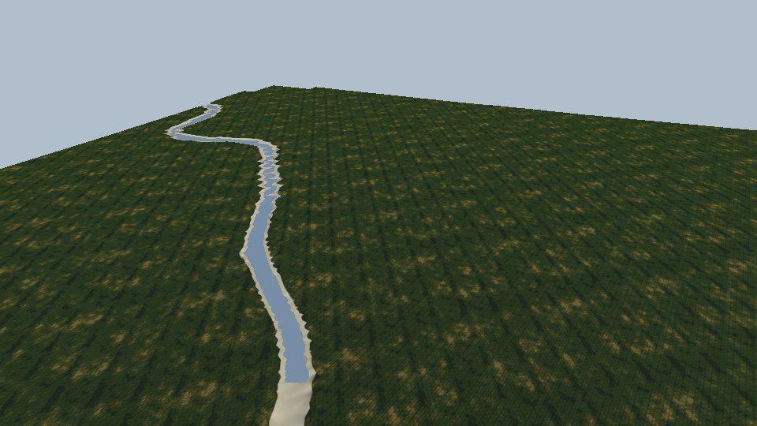

# Slavonia: an open-world fishing sim on the Bosut, Spačva, Sava and beyond

The final product is a big, continuous open world built from real geography. It covers realistic rivers
and lakes, real towns and villages, and travel between fishing sites by road (car, tractor) and by water
(boat).

The first area is the player's home ground: **Vinkovci, Andrijaševci and Rokovci, the Bosut, the Spačva
forest and the Sava at Županja**. That is 44 × 38 km (`tools/geodata/areas.py`, `bosut`). The world uses
real coordinates, so later areas join up with it rather than becoming separate maps: Vukovar and the
Danube to the east, Osijek, the Drava and Kopački rit to the north, and Slavonski Brod up the Sava.

This file is the plan and the record of decisions. Update it as milestones land. Visual references are in
[TARGETS.md](TARGETS.md), and the data pipeline is in [tools/geodata](../../tools/geodata/README.md).

## Principles

- **Regions, not a rewrite.** Anything specific to a place lives in `src/regions/<id>/`. The engine, sky,
  post-processing, fishing mechanics, UI and save system stay shared. `?region=slavonia` selects the new
  region. The Caribbean island stays the default until Slavonia plays better, so `main` is never broken
  halfway through the port.
- **Real data first, hand-built where it matters.** Terrain, water, roads, buildings and land cover are
  generated from open data. Hand-built detail goes into the fishing spots, the town centres, the bridges
  and the harbours. Nothing in the world should contradict the real map.
- **Data is processed offline and deterministically.** `tools/geodata` turns the raw data into game tiles.
  The browser only streams the tiles, and the raw data is never committed.
- **Reuse the simulations.** The FFT waves work for lakes and the wide Sava, with a short fetch and
  light wind. The shallow-water shore sim and the boat wake carry over. Swell, breakers and surf are
  ocean-only and off in this region.
- **Every number gets checked.** Species data, sizes and prices come from published values, and anything
  unverified says so in a comment. Fishing rules (closed seasons, minimum sizes, licences) must be
  checked against current Croatian law before they go in.
- **Test what can be tested headlessly.** Run the logic and data tests in node. Shots of the engine come
  from the bench (`?bench&shots=`), and the targets in TARGETS.md are the visual check.

## Engine changes an open world needs

The engine was built for a 2 km island. These are the structural changes, in the order they block
everything else:

1. **Streaming tiles.** Terrain, water, vegetation, buildings and roads load and unload in tiles around
   the player, for example 1 km tiles with the farther tiles at lower detail. The CDLOD code
   (`core/CDLOD.js`) already does the terrain LOD for one heightmap. It needs a tiled source.
2. **Precision.** Positions are kept relative to a floating origin near the camera. At 20+ km from
   the origin, float32 world positions lose millimetres, and TAA and motion vectors jitter.
3. **Water at many levels.** The engine has one global water plane (`G.seaLevel`). Here the Sava, the
   Bosut, the canals and every lake have their own level, and the rivers slope gently. Water needs
   per-body surfaces (a level per lake, a level profile along each river) and per-body depth, flow,
   colour and turbidity.
4. **Vehicles on roads.** The road meshes follow the terrain, bridges cross water, and car and tractor
   physics run on them. The existing boat controller covers the rivers.
5. **Instanced towns.** About 108,000 buildings in the first area. Most can come from a handful of
   procedural archetypes (Šokac street house, newer two-storey house, apartment block, barn, church,
   industrial hall), merged per tile and LODed down to impostors.

## Milestones

### M0: Foundation (done)
- [x] Region system: `src/regions/index.js` and `?region=`, with a separate save per region.
- [x] Caribbean fish table and habitats moved into `regions/caribbean/` unchanged.
- [x] Slavonian species table: 20 species with Croatian names, length-weight relations and stand-in
  models.
- [x] River and lake habitats: shallows, weeds, current, slack, still, snags and deep.
- [x] Tests: `test/region-slavonia.mjs`.

### M1: Geodata pipeline (in progress)
- [x] Fetch Overture Maps (water, roads, buildings, land use, bridges, places), the Copernicus 30 m
  elevation, ESA WorldCover and Sentinel-2 for an area (`tools/geodata/fetch.py`).
- [x] Overview map and satellite renders (`overview.py`, `satellite.py`), and the target images.
- [x] **Bare-earth terrain** (`terrain.py`). Forest canopy and buildings are removed from the surface
  model using the land cover and refilled from the surrounding ground. River channels and lake basins
  are cut in from the water geometry.
- [x] **Water bodies.** A level for each lake, and a downstream-falling level profile for each river,
  joined by name. Trapezoid channels by class.
- [ ] Water body refinements: the measured Bosut cross-section in the villages, cut banks and point
  bars on the Sava, and a flow speed per river (the Sava is fast, the Bosut slow, the canals almost
  still).
- [x] **Tile format** (`tiles.py`, `TWT1`). 1 km tiles on the HTRS96/TM grid with 101 × 101 samples
  at 10 m: ground height and water level (u16, cm) and land cover (u8), about 50 KB a tile. The full
  area is about 1,700 tiles (~85 MB) and stays out of git. A playable core block is exported to
  `public/world/<area>/` with an `index.json` that carries the data credits.
- [ ] Roads, buildings and scatter seeds in the tiles.
- [x] First core block: 5 × 5 km around the Bosut between Rokovci and Andrijaševci
  (`public/world/bosut/`).

### M2: Streaming world (engine)
- [x] Slavonian ground shader (`regions/slavonia/GroundSurface.js`, Terrain's `surface` option): mown
  grass banks, meadow, strip fields, gardens, forest (canopy tone from afar until the trees exist),
  wet silt at the waterline and the river bed, all from the land-cover masks.
- [x] `?region=slavonia` loads the tiles in the real game (`regions/slavonia/world.js`). App skips the
  island's village, plants, rocks, debris, reef, breakers, whale and shore wildlife (null and guarded),
  sets calm, turbid water, turns the surf off, and places the start, the boat and the two stalls by
  the bridge. The debug and bench views become the progress views. Verified on an RTX 3080 at 180 fps
  (2026-10-02).
- [x] Inland water. The world has one water plane at the datum, so anywhere the ground sits at or
  below it is wet, and the patch read as an island in a sea. Three things reported the wrong height
  outside the patch: `TileTerrain` gave 0 (now the median of its own dry ground), `Terrain` drew the
  mesh only over the data (now an `extent`, 131 km for Slavonia, past the horizon of the highest
  view), and the GPU's `terrainHeightAt` returned the island's -90 m ocean floor (now a
  `TerrainParams.outside` uniform, the same value the CPU heightfield uses). The sun shadow is baked
  over the patch only, so beyond it the ground is lit rather than taking the edge texel's horizon.
  Only the carved channels are wet, and the ground shader carries the strip fields out to the horizon.
- [x] Slavonian flora (`regions/slavonia/Flora.js`): white willow leaning out over the water on the
  bank, black poplar in the fields, oak and ash in the floodplain wood, a reed bed in the shallows,
  and tall bank meadow. The tree shape moved out of `PlantGeometry.buildTreeNear` into a species
  spec (`buildBroadleafTree`), so a region declares its own trees; the island's is `ISLAND_TREE` and
  is unchanged. Three seeds per species, so a bank is not one crown repeated.
- [x] The roads, the villages, the bridges and the churches on their real footprints
  (`tools/geodata/places.py` -> `places.json`; `Roads.js`, `Buildings.js`, `Bridge.js`).
- [x] Two-level heightfield. The patch is 2 km of metre data; `Heightfield` now takes a coarser
  `far` field, which `TileTerrain` builds from a 12 km ring of the 10 m tiles with the same channels
  cut into it, and `TerrainGPU` samples beyond the fine domain. The rivers, the canals and the lie
  of the land carry on past the patch instead of stopping at a flat plain.
- [x] Far crowns as impostors, baked from the same three crowns per species; beyond those the
  ground shader's canopy tone stands in.
- [x] The yards: the fence and gate that close each plot to the street, and the winter's firewood.
- [ ] The river's wave scale is the region's (ripple-sized FFT cascades, 2.5 m depth, almost no
  foam), but the water still reads as a lake surface: no current, no reflection of the banks.
- [x] `TileTerrain` (regions/slavonia): a heightfield patch from the tiles, with heights relative to
  the patch's water level. It feeds the existing terrain pipeline unchanged, because the shared
  queries moved into `world/terrain/Heightfield.js`, which the island's `TerrainData` now extends.
  `test/world-slavonia.mjs` renders it headless.

  
- [ ] Tiled terrain with CDLOD over streamed tiles, and a floating origin.
- [ ] The region selects the world: island (Caribbean) or tiles (Slavonia). The `WORLD` layout,
  ShoreSim, Breakers, Reef and Whale become region-provided or optional.
- [ ] Decouple `FishSchools` from `Reef`, which owns every swimming fish today.
- [ ] Per-body water surfaces and levels. The FFT waves get lake and river settings, and the ocean-only
  systems switch off.
- [ ] Map screen and minimap from the tiles.

### M3: Rivers and lakes
- [x] Cut the channels at full resolution (1 m) from the river centrelines when the patch loads
  (`TileTerrain.cutChannels`, lines in `rivers.json` with water level and bank top). The tiles hold
  the ground without the line channels.
- [x] River levels are a least-squares downstream-falling fit. A running minimum dragged whole
  rivers down to the lowest spot upstream.
- [ ] Regulated channels from cross-section profiles along the data centrelines: bed, mown grass
  slopes, berm and the road on top. This is how the Bosut looks through the villages (see the local
  photos in TARGETS.md). Wilder banks between the villages.
- [ ] Fishing platforms (plank decks on posts) placed along the village banks, in several states of
  wear. The first hand-built asset family.
- [ ] Reflections on calm water: on a still day the Bosut is a mirror, so the reflection quality on a
  nearly flat surface matters more than the waves.
- [ ] Variable water level (summer low water exposes mud and silt, winter and spring high water
  spreads wider and flows faster), with bank materials following the level.
- [ ] Flow field per river (speed and direction from the centreline, width and bends, eddies at
  bridges and snags). It feeds the habitats, the drift of the float and line, floating leaves and
  debris, and the boat.
- [ ] Turbid green-brown water: about 0.5–1 m visibility in the Bosut, more in the gravel pits, with
  muddy Sava water after rain.
- [ ] Banks: clay cut banks, willow roots, reed and cattail beds, water lilies, anglers' clearings
  and footpaths, wooden fishing platforms.

### M4: Roads, vehicles and travel
- [ ] Road meshes by class from the data: asphalt and markings for the A3/D55/D46, narrow village roads,
  gravel and dirt field tracks. Bridges from the data (245 in the area), including the Sava bridge at
  Županja.
- [ ] Car, then tractor with trailer, then bicycle. Fuel, parking at fishing spots, carrying gear.
- [ ] Boats: a flat-bottomed čamac with an outboard on the Sava and the wider Bosut, launched from slips.
- [ ] Fast travel between discovered spots, and a map screen.
- [ ] Later: local traffic, buses and trains on the Vinkovci lines.

### M5: Towns and villages
- [ ] Building archetypes from footprints: Šokac gable-end houses facing the street with a porch
  (*ganak*) and gate, newer houses, barns, corn cribs, apartment blocks (Vinkovci, Županja),
  churches, schools and industrial halls.
- [ ] Street dressing: fences and gates, wells, benches, power poles (1,240 in the data), bus stops
  and street lights.
- [ ] Hand-built centres: Vinkovci (Korzo, the Bosut promenade, the churches, the railway station),
  Županja (centre and Sava front), and Andrijaševci and Rokovci.
- [ ] Shops and places: tackle shops, bars and the fishing clubs from the data. The fish market or
  restaurant that buys the catch.

### M6: Land and life
- [ ] Fields from the satellite parcels: strip fields with crops by season (maize, wheat,
  sunflower, soy), field margins and tree lines.
- [ ] Forest: pedunculate oak (Spačva), ash, hornbeam, white willow and poplar along the water, and
  orchards behind the houses.
- [ ] Birds and animals: herons, egrets, cormorants, storks, kingfishers, deer and wild boar in Spačva,
  frogs and mosquitoes at dusk.
- [ ] Soundscape: the river, the wind in the poplars, frogs, church bells, distant tractors and the A3.

### M7: Freshwater fish models
- [ ] Anatomy and skin patterns for the 20 species, replacing the stand-ins. Most share body plans:
  cyprinids, carps, percids, pike, catfish and the sturgeon.
- [ ] New geometry: barbels, the sterlet's scutes and tail, and the wels's long anal fin.
- [ ] Swimming fish in the rivers and lakes.

### M8: Fishing realism
- [ ] Techniques: float, feeder/ledger, carp rigs, spinning, and the catfish clonk (*bućkalica*) from
  the boat. Baits change what bites.
- [ ] Seasons, water temperature and water levels: spring high water, summer low water, autumn fog.
- [ ] Regulations: closed seasons, minimum sizes and licences. Verify these first.
- [ ] Economy in euros, with river-fishing gear.

### M9: Grow the world
- [ ] Vukovar and the Danube, then Osijek, the Drava and Kopački rit, then Slavonski Brod up the Sava.
- [ ] When Slavonia plays better than the island, make it the default region.

## Where the island is baked in

The coupling map for M2:

- `WORLD` (world/WorldLayout.js) is read by about 20 modules: terrain, reef, pier, fish, rocks, debris,
  vegetation scatter, birds, crabs, game, minimap, audio, player and boat. Terrain.js bakes `swellDir`
  and the reef into its WGSL as literals.
- `TerrainData` builds the island from hardcoded ellipses (`_coast`), the bay box (`beachZoneAt`),
  `IslandShape`, and z-ranges in `_detail`/`_features`/`_seabed`. The borders fade to -90 m.
- The water globals are in `engine/render/Frame.js`: `seaLevel`, `waterAbsorption`,
  `waterScattering`, `windSpeed` and `windDir`. OceanFFT systems use the `local` and `swell` defaults.
  AppUI's clarity slider scales around the tropical defaults.
- `Reef` owns `FishSchools`, so every swimming fish. App.js updates Reef, Breakers and Wildlife
  unconditionally.
- Fish skins are one WGSL branch per `PATTERN` id in FishMaterial.js.

## Development

- `npm test`: the game logic, the Slavonian region data, and an engine smoke test. The smoke test
  needs a WebGPU adapter; in a headless Linux container, install `mesa-vulkan-drivers` for lavapipe.
- `npm run dev`, then `/?region=slavonia`. Until M2 this shows the island with the Slavonian fish.
- Geodata: see `tools/geodata/README.md`.
- Progress timelapse: after every build step, run `tools/progress/shoot.sh "label"` and commit the
  result. It renders the fixed views in `src/regions/slavonia/views.js` into
  `docs/slavonia/progress/<view>/` and logs the step in `docs/slavonia/progress/README.md`.
  `python3 tools/progress/timelapse.py` turns a view's series into a GIF. Never move a view; add new
  ones instead.
