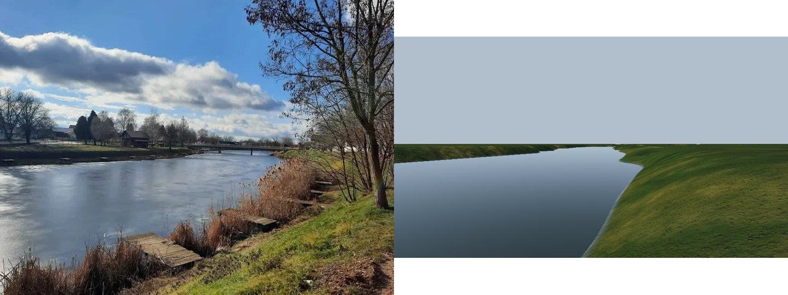
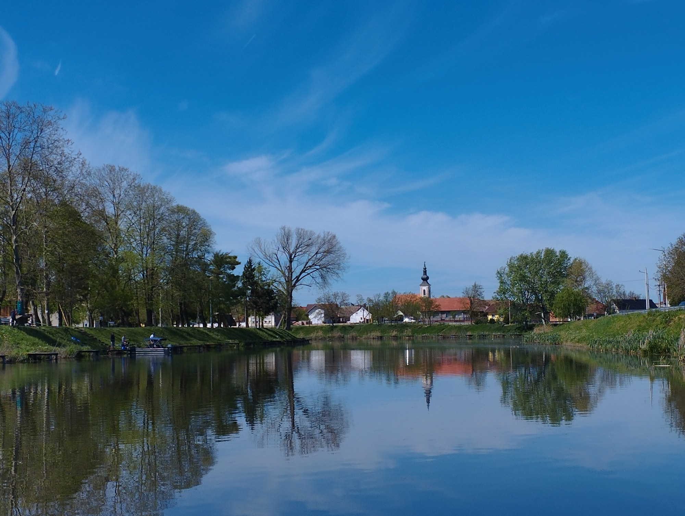
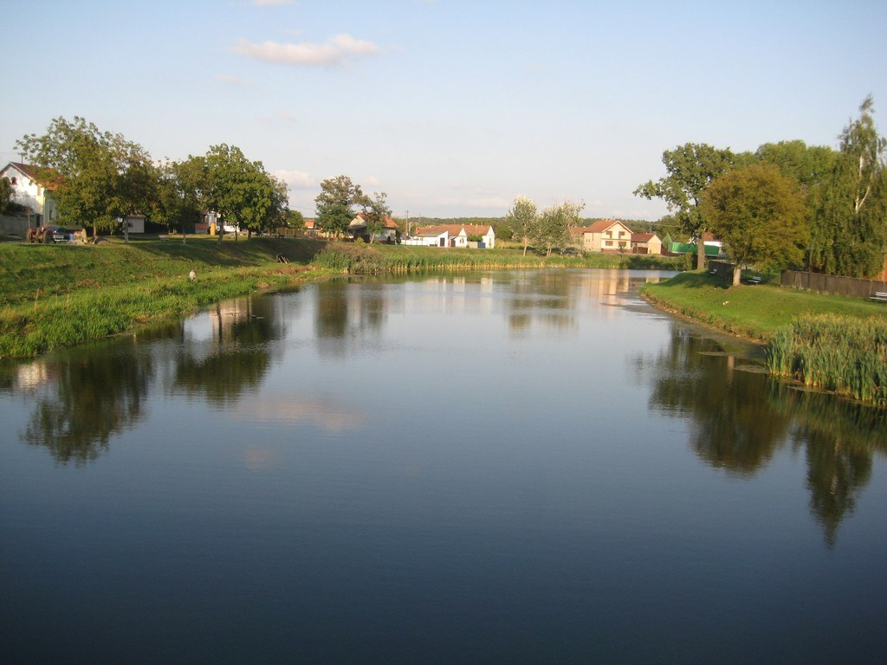
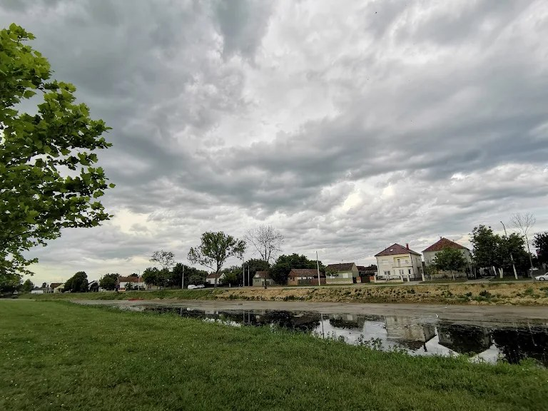
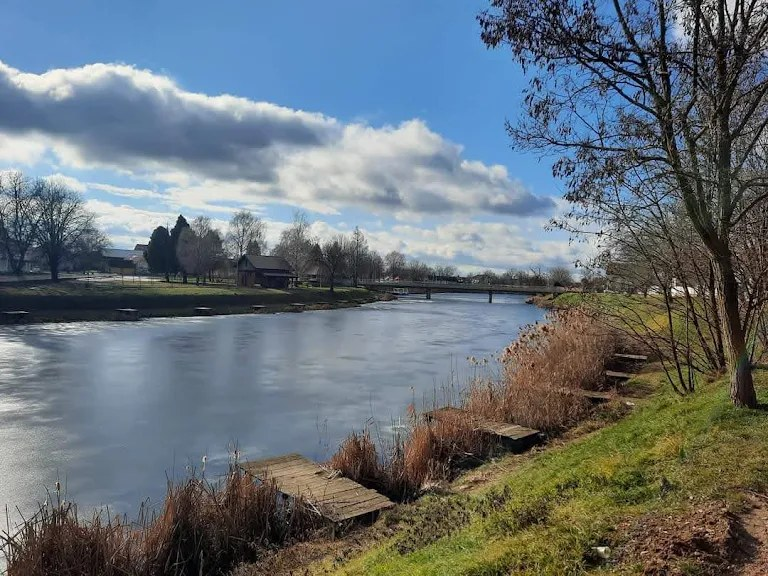
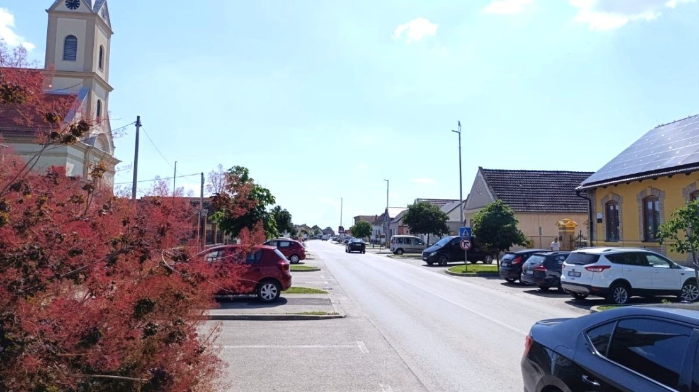
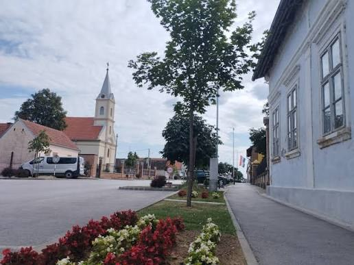
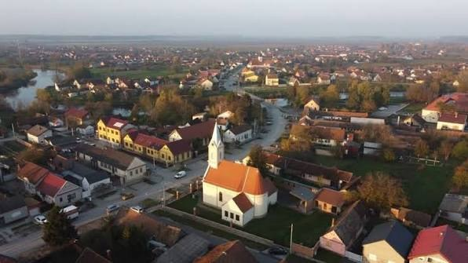

# Visual targets

Rendered views of the game get compared against these references. Each target names what to look at.
When a matching in-game view exists, it gets a camera in `src/core/DebugViews.js` so the same shot can be
taken before and after a change (`?bench&shots=<view>`, see `core/Bench.js`).

## 1. Top-down: Sentinel-2, 2 July 2025

`tools/geodata/satellite.py` renders any close-up of the area from the same scenes. These are the
targets for the aerial and map views:

- **Field patterns.** Long, narrow strip fields radiate from the villages. The colours mix green maize
  and soy, golden harvested wheat and brown ploughed soil, with grass margins between the strips.
- **Villages.** Street villages (*ušorena sela*) have houses packed along the roads and long gardens
  and orchards behind them.
- **The Bosut.** A dark green, tree-lined ribbon about 30–40 m wide that winds through Rokovci and
  Andrijaševci. Beside it runs the straight canal through the forest.
- **The Spačva forest.** Dense, even canopy cut by straight rides (*prosjeke*), with clearings
  and young stands in lighter green.
- **The Sava at Županja.** Wide meanders with sand bars, and willow forest between the levees.

## 2. The map

This map comes from the open data (`tools/geodata/overview.py`). It is the target for the in-game
minimap and map screen, and the check that the world's rivers, roads and towns are where they really
are.

## 3. Ground level

Wikimedia Commons is blocked by this development environment's network policy, so these are links to
open by hand. They are not downloaded copies. Allow `commons.wikimedia.org` and `upload.wikimedia.org`
in the environment's network settings to have images pulled in with their licences recorded.

- [Category:Bosut River](https://commons.wikimedia.org/wiki/Category:Bosut_River), which includes
  "Bosut in Vinkovci": banks, bridges, the promenade and the water colour.
- [Category:Vinkovci](https://commons.wikimedia.org/wiki/Category:Vinkovci): the centre, the Korzo
  (Ulica kralja Zvonimira), the railway station and the churches.
  - [Korzo, Vinkovci](https://commons.wikimedia.org/wiki/File:Korzo-ulica_kralja_Zvonimira,_Vinkovci_(1).jpg)
  - [Ulica kralja Zvonimira 1](https://commons.wikimedia.org/wiki/File:Z-4191_Ulica_Kralja_Zvonimira_1_Vinkovci_(001).jpg)
  - [HŽ 1141 locomotive at Vinkovci](https://commons.wikimedia.org/wiki/File:H%C5%BD_1141_Vinkovci.jpg)
- [Category:Andrijaševci](https://commons.wikimedia.org/wiki/Category:Andrija%C5%A1evci)
- [Category:Spačva](https://commons.wikimedia.org/wiki/Category:Spa%C4%8Dva), including the Spačva river.
  - [Studva by the Soljani forest](https://commons.wikimedia.org/wiki/File:Studva_uz_soljansku_%C5%A1umu.jpg)
  - [Quercus robur (hrast lužnjak)](https://commons.wikimedia.org/wiki/File:Quercus_robur_-_Hrast_lu%C5%BEnjak_(1).jpg)
- [Category:Županja](https://commons.wikimedia.org/wiki/Category:%C5%BDupanja), including the Sava in
  Županja with the sugar factory.
- [Category:Sava in Croatia](https://commons.wikimedia.org/wiki/Category:Sava_in_Croatia)

## 4. Local photos (provided by the project owner)

Reference only: these show what to match and do not ship in the game.

**Where the river photos were taken.** Mostly near **Most Bosut**, the road bridge between Rokovci (north
bank) and Andrijaševci (south bank), at 45.22730, 18.74159 (HTRS96/TM 676024, 5012149). They are from
the south-east side: the riverside park (Adrenalinski park Bosut) on the south bank just east of the
bridge. Here the Bosut runs roughly east to west. **St Roch's church** (Crkva sv. Roka, Rokovci) stands
about 200 m north of the bridge, and is the onion-dome tower seen across the water. **St Andrew's**
(Crkva sv. Andrije, Andrijaševci) is about 190 m south.

The playable core block (`public/world/bosut/`) is centred on this bridge, and `test/world-slavonia.mjs`
has camera views at the approximate photo positions (`photoBridge`, `photoChurch`).

Progress against the winter photo (left), shown on the right:

The landform and the river line are there. Next are the bridge, the platforms, the reeds, the
trees, the houses and the real water surface.

### The Bosut

`bosut-spring-anglers-church-reflection.jpg`: **the main target for the fishing spot.**
- **The channel is regulated.** It is a straight, even trapezoid with mown grass slopes. It is not a
  wild river bank.
- **Wooden fishing platforms** run along the waterline every 10–20 m: low, plank-decked, with posts
  in the water. Anglers sit on boxes with long poles and feeder rods, under umbrellas or shades.
- **The water is a mirror on a calm day.** It shows almost no ripple, so the reflections of the trees,
  houses and church dominate. The water colour reads as the sky reflection over dark olive-brown depth.
- **The margins are reeds and cattails,** in thick clumps at the foot of the slope on the far bank.
- **Behind the bank** stand tall ash, poplar and willow (the spring leaves are just out), a few
  conifers and a large bare old tree.
- **The skyline** is low houses with red and orange tile roofs, a long single-storey building, and the
  church tower with an onion dome above everything.
- **On the embankment top on the right** run the road, a guardrail and concrete lamp posts.

`bosut-evening-calm.jpg`
- Low golden sun and calm water reflecting the sky, with grassy banks sloping straight into the water.
- Cattail clumps stand out from the bank. A path runs on the bank top, and a tractor is parked by a
  house. White and yellow houses with red roofs sit on the bank top, with forest on the horizon.

`bosut-low-water-overcast.jpg`: **the low-water state**.
- The level has dropped about a metre and exposed a band of grey-brown mud and dried silt on the
  slope. The water is shallow and dark with weed showing.
- Heavy stratocumulus overcast. Mown lawn in the foreground, with a two-storey house and older
  single-storey houses along the road behind.
- Water level must be a variable (seasons, drought), and the exposed bank needs its own material.

`bosut-winter-platforms-bridge.jpg`: **winter and higher water.**
- **The water is higher and moving.** It is a wider sheet with a visible flow ripple, a grey-blue
  sky reflection and a little current.
- **The fishing platforms** are plank decks on posts, set into dead, straw-coloured reeds.
- **A low concrete road bridge** crosses on thin piers.
- **The far bank** has bare trees, dark thujas or cypresses, and a wooden shed.
- **The ground** is short winter grass and a worn footpath on the slope.

### The village

`village-main-street-church-parking.jpg`
- A wide asphalt main road with a centre line. Angled parking bays with kerbed grass islands sit
  on both sides.
- **Houses stand gable-end to the street:** single-storey, plastered in yellow or cream, with
  brick-trimmed window arches. Brown tile roofs, some with solar panels.
- The church tower is cream and ochre with a clock, behind a red smoke bush (*Cotinus*).
- Overhead lines on concrete poles, tall street-lamp masts, a pedestrian crossing sign, young
  street trees, a yellow post box.
- Everyday cars: Dacia, Ford, VW, Škoda. Bright summer haze, and the street fades into a flat
  horizon.

`village-street-church-blue-house.jpg`
- An older house painted pale blue with moulded window frames and a deep eave, right on the
  pavement.
- A classicist church with a tall pointed steeple, beside a brick house.
- Flower beds of red and white begonias, a young tree on the median, and a concrete pavement with
  a kerb.

`village-aerial-autumn.jpg`: **the target for the aerial and drive-in view.**
- A white church with an orange roof and a white spire on a green plot at a junction.
- **Dense street rows of houses** with red and orange roofs, a few yellow two-storey buildings, and
  long gardens and sheds behind them.
- The river or an oxbow on the left edge, with golden autumn trees and haze to a flat horizon.

### What these change in the plan

- **The Bosut in the villages is a regulated channel.** Build it from a cross-section profile (bed,
  slopes, berm, road on top) along the data's centreline, not from the 30 m elevation data. Between the
  villages it can be wilder: reeds, willows, forest.
- **Fishing platforms** are a key asset family: plank deck, posts, steps, in several states (new,
  weathered, half-sunk). Place them along the banks near villages.
- **Calm water and reflections matter more than waves** here. The water shader's
  planar and screen-space reflection quality on a nearly flat surface is the priority, not the FFT
  swell.
- **The water level varies** (low summer water, high winter and spring water). It shows on the bank
  as mud, silt and dead reed bands.
- **The village kit** for M5:
  - Gable-end houses with plastered colours (yellow, cream, white, pale blue), brick or moulded
    window trims and tile roofs.
  - Churches (onion-dome baroque and pointed classicist).
  - Concrete poles with overhead lines, angled parking with grass islands, flower beds.

## 5. Still wanted

- The water up close (colour and clarity at the bank), and the platforms up close.
- The Bosut between the villages (wild stretches), and the Bosut in Vinkovci (the promenade).
- The Spačva forest: the oaks, a forest road, a flooded part, the Spačva river.
- The Sava at Županja: the levee (*nasip*), the beach, and the bridge to Orašje.
- Village streets: a Šokac house front, the gate, the church, a well, a corn crib (*kotarka*).
- A gravel pit or lake where people fish, and an angler's setup.
- Roads: a village road, the D55, a field track after rain.

Put them in `docs/slavonia/photos/` with the place and date in the file name, for example
`2026-10-04_bosut-rokovci-bridge.jpg`.

## Fishing spots from the data

These anchor the first hand-built locations:

| Place | Where | Notes |
|---|---|---|
| **Most Bosut and the park** | Rokovci–Andrijaševci, bridge 45.2273, 18.7416; park 45.2266, 18.7432 | **First hand-built spot.** The local photos are from here. |
| Ribička kuća | on the Rakovac, 45.2587, 18.7075 | Anglers' house and campground |
| ŠRD "Strušac" | Retkovci, 45.2002, 18.6495 | Sport fishing club |
| Banja lake | Vinkovci, 45.2876, 18.7848 | 18 ha, in town |
| Bajer | Vinkovci, 45.3039, 18.8196 | 14 ha |
| Bosut promenade | Vinkovci centre, 45.2882, 18.7978 | Town river |
| Sava at Županja | 45.0762, 18.6891 | The big river: levees and beach |
| Akumulacija Grabovo | 45.2700, 19.0723 | 77 ha reservoir |
| Bosut upstream | Sopot, Rokovci, Cerna to the Biđ mouth, then down to Šiškovci | The best Bosut stretches according to local fishing guides |
