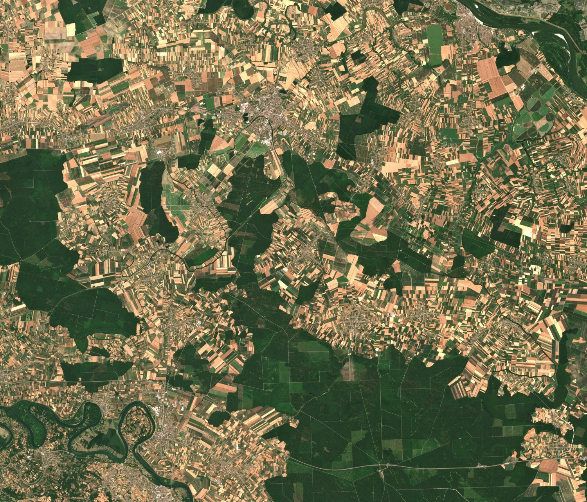
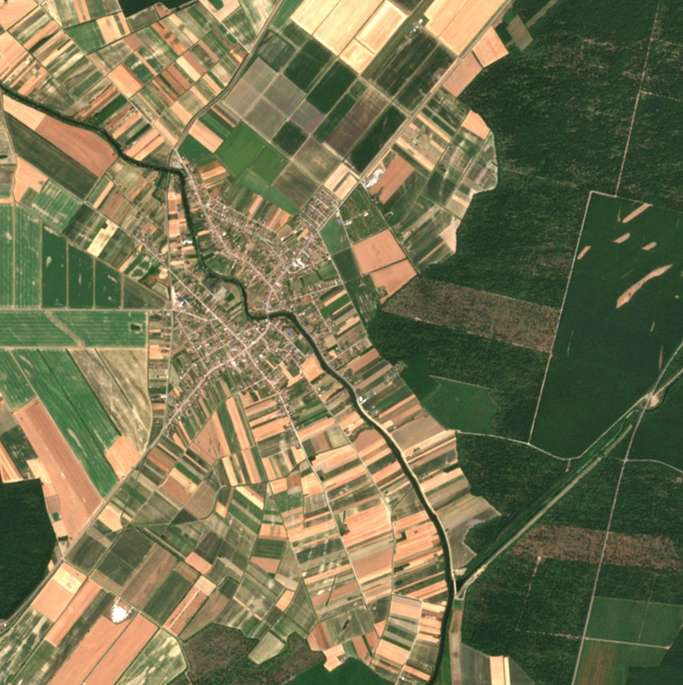
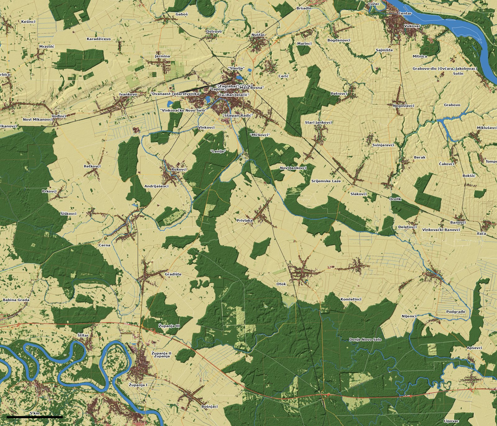
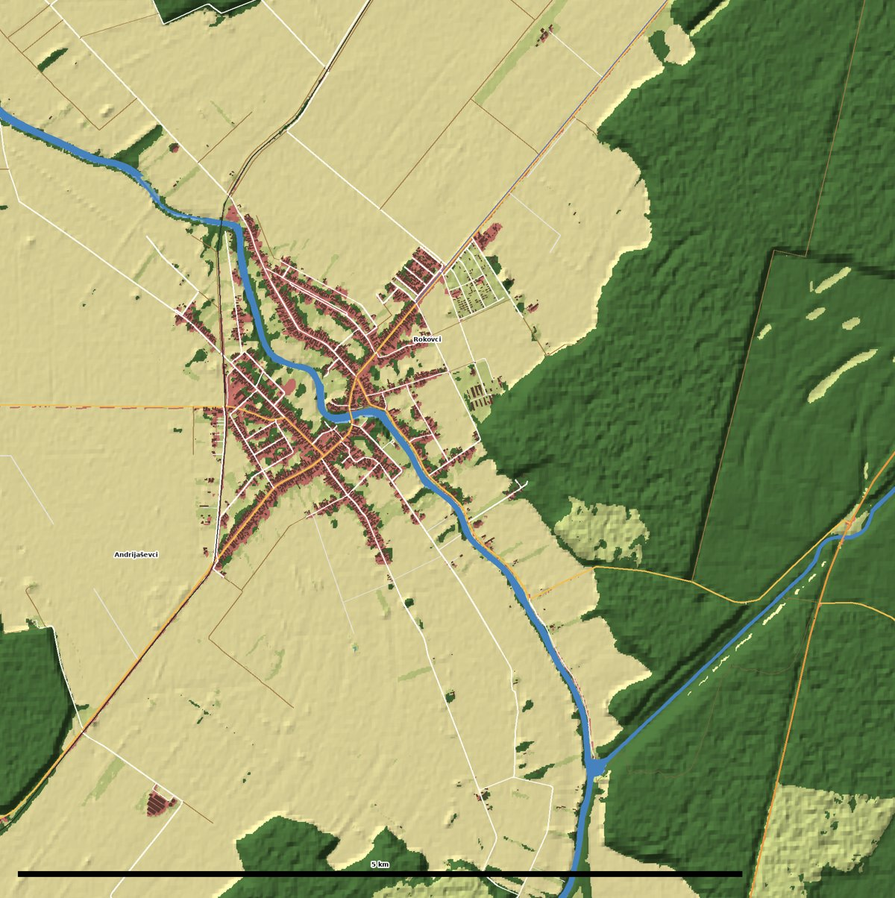

# Visual targets

Rendered views of the game get compared against these references. Each target names what to look at.
When a matching in-game view exists, it gets a camera in `src/core/DebugViews.js` so the same shot can be
taken before and after a change (`?bench&shots=<view>`, see `core/Bench.js`).

## 1. Top-down: Sentinel-2, 2 July 2025

`tools/geodata/satellite.py` renders any close-up of the area from the same scenes. These are the
targets for the aerial and map views:

- **Field patterns.** Long, narrow strip fields radiate from the villages. The colours mix green maize
  and soy, golden harvested wheat and brown ploughed soil, with grass margins between the strips.
- **Villages.** Street villages (*ušorena sela*) have houses packed along the roads and long gardens
  and orchards behind them.
- **The Bosut.** A dark green, tree-lined ribbon about 30–40 m wide that winds through Rokovci and
  Andrijaševci. Beside it runs the straight canal through the forest.
- **The Spačva forest.** Dense, even canopy cut by straight rides (*prosjeke*), with clearings
  and young stands in lighter green.
- **The Sava at Županja.** Wide meanders with sand bars, and willow forest between the levees.

## 2. The map

This map comes from the open data (`tools/geodata/overview.py`). It is the target for the in-game
minimap and map screen, and the check that the world's rivers, roads and towns are where they really
are.

## 3. Ground level

Wikimedia Commons is blocked by this development environment's network policy, so these are links to
open by hand. They are not downloaded copies. Allow `commons.wikimedia.org` and `upload.wikimedia.org`
in the environment's network settings to have images pulled in with their licences recorded.

- [Category:Bosut River](https://commons.wikimedia.org/wiki/Category:Bosut_River), which includes
  "Bosut in Vinkovci": banks, bridges, the promenade and the water colour.
- [Category:Vinkovci](https://commons.wikimedia.org/wiki/Category:Vinkovci): the centre, the Korzo
  (Ulica kralja Zvonimira), the railway station and the churches.
  - [Korzo, Vinkovci](https://commons.wikimedia.org/wiki/File:Korzo-ulica_kralja_Zvonimira,_Vinkovci_(1).jpg)
  - [Ulica kralja Zvonimira 1](https://commons.wikimedia.org/wiki/File:Z-4191_Ulica_Kralja_Zvonimira_1_Vinkovci_(001).jpg)
  - [HŽ 1141 locomotive at Vinkovci](https://commons.wikimedia.org/wiki/File:H%C5%BD_1141_Vinkovci.jpg)
- [Category:Andrijaševci](https://commons.wikimedia.org/wiki/Category:Andrija%C5%A1evci)
- [Category:Spačva](https://commons.wikimedia.org/wiki/Category:Spa%C4%8Dva), including the Spačva river.
  - [Studva by the Soljani forest](https://commons.wikimedia.org/wiki/File:Studva_uz_soljansku_%C5%A1umu.jpg)
  - [Quercus robur (hrast lužnjak)](https://commons.wikimedia.org/wiki/File:Quercus_robur_-_Hrast_lu%C5%BEnjak_(1).jpg)
- [Category:Županja](https://commons.wikimedia.org/wiki/Category:%C5%BDupanja), including the Sava in
  Županja with the sugar factory.
- [Category:Sava in Croatia](https://commons.wikimedia.org/wiki/Category:Sava_in_Croatia)

### Wanted: local photos

Photos taken on location are the best targets, because they show exactly the places being built. The
same spot in the morning, at noon and at dusk is ideal. Wanted:

- The Bosut in Andrijaševci and Rokovci: the banks, the angling spots, the bridge, and the water up close.
- The Bosut in Vinkovci: the promenade and the bridges.
- The Spačva forest: the oaks, a forest road, a flooded part, the Spačva river.
- The Sava at Županja: the levee (*nasip*), the beach, and the bridge to Orašje.
- Village streets: a Šokac house front, the gate, the church, a well, a corn crib (*kotarka*).
- A gravel pit or lake where people fish, and an angler's setup.
- Roads: a village road, the D55, a field track after rain.

Put them in `docs/slavonia/photos/` with the place and date in the file name, for example
`2026-10-04_bosut-rokovci-bridge.jpg`.

## Fishing spots from the data

These anchor the first hand-built locations:

| Place | Where | Notes |
|---|---|---|
| Adrenalinski park Bosut | Rokovci–Andrijaševci, 45.2266, 18.7432 | On the Bosut between the twin villages |
| Ribička kuća | on the Rakovac, 45.2587, 18.7075 | Anglers' house and campground |
| ŠRD "Strušac" | Retkovci, 45.2002, 18.6495 | Sport fishing club |
| Banja lake | Vinkovci, 45.2876, 18.7848 | 18 ha, in town |
| Bajer | Vinkovci, 45.3039, 18.8196 | 14 ha |
| Bosut promenade | Vinkovci centre, 45.2882, 18.7978 | Town river |
| Sava at Županja | 45.0762, 18.6891 | The big river: levees and beach |
| Akumulacija Grabovo | 45.2700, 19.0723 | 77 ha reservoir |
| Bosut upstream | Sopot, Rokovci, Cerna to the Biđ mouth, then down to Šiškovci | The best Bosut stretches according to local fishing guides |
