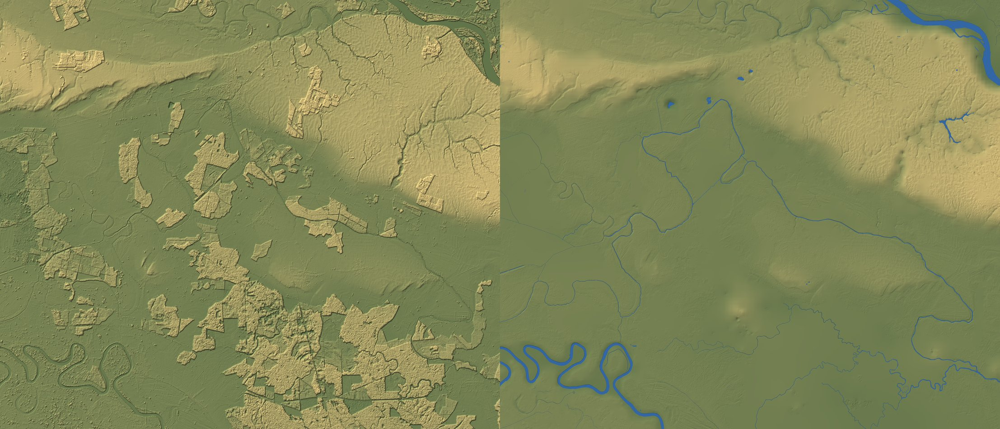

# Geodata: the real world behind the Slavonian map

Scripts that download open map data for an area of the open world and turn it into planning images.
Later, they will also turn it into game tiles. Areas are defined in `areas.py` in WGS84 degrees. The
world uses the Croatian national grid, HTRS96/TM (EPSG:3765), so areas added later join up seamlessly.

```sh
pip install pyarrow s3fs rasterio numpy pillow pyproj shapely scipy
python3 tools/geodata/fetch.py bosut              # ~1 GB into tools/geodata/cache/bosut/ (not committed)
python3 tools/geodata/overview.py bosut           # map: land cover, relief, water, roads, buildings, names
python3 tools/geodata/satellite.py bosut          # Sentinel-2 true colour mosaic
python3 tools/geodata/overview.py bosut out.png 2000 45.225,18.75,6    # 6 km close-up (lat, lon, km)
python3 tools/geodata/terrain.py bosut 10         # bare-earth terrain + water bodies at 10 m (~10 min)
python3 tools/geodata/tiles.py bosut              # all 1 km world tiles -> cache/bosut/tiles/
python3 tools/geodata/tiles.py bosut core 45.225,18.75,4   # the playable core -> public/world/bosut/
node test/world-slavonia.mjs /tmp --small         # render the core through the engine's terrain (headless)
```

## Terrain (`terrain.py`)



1. **Bare earth.** Cells under forest, shrubs and buildings (from WorldCover, plus a 30 m margin) are
   refilled from the open ground around them. Mounds the land cover missed, such as tree groups and
   hedges, are found against the large-scale surface and refilled too. About half the area is refilled.
   Fields, levees, old river channels and the loess edge keep the original data.
2. **Water levels.**
   - Lakes and ponds take the level the elevation model flattened them to.
   - Rivers and canals are joined by name and take a level profile along their centreline. OSM lines
     run downstream, and the level never rises downstream. The Bosut falls from 80.6 to 77 m through
     the area, and the Sava from 81.8 to 73 m.
3. **Channels.** Every river, canal, stream and ditch is cut in with a trapezoid section by class, and
   the named rivers have measured widths: Bosut 32 m, Sava 190 m. Lakes get basins that deepen away
   from the shore. Dry (intermittent) ditches are cut but stay dry.

The outputs are in `cache/<area>/terrain/`: `dtm.tif`, `water.tif` (water level or NaN) and `water.json`
(the bodies).

Limits to fix later:
- **Depths and bank slopes are typical values per class, not measured.** The Bosut's real
  cross-section in the villages is a regulated trapezoid (see the local photos in
  docs/slavonia/TARGETS.md), and it should replace the generic one there.
- **Rivers without a mapped area get a fixed width.** The Sava's real width varies.
- **Levels come from a 30 m model,** so they are good to about half a metre. Fine for the look; tune
  them against the photos at the fishing spots.

## World tiles (`tiles.py`)

The tiles are 1 km squares on the HTRS96/TM grid, named by their south-west corner (`t_<east>_<north>.bin`),
with 101 × 101 samples at 10 m. Neighbouring tiles share their edge samples. Each tile holds the
ground height and the water level (u16, cm above sea level, 0 = dry), and the land cover class (u8).
The format is documented in the script header, and `src/regions/slavonia/TileTerrain.js` reads it.

The full area is about 1,700 tiles (~85 MB), which is too much for git. Only the playable core goes
into `public/world/`. The rest will need hosting outside the repository once the game streams it.

## Sources

All of these are open data on AWS S3, with anonymous access.

| Data | Source | Licence | Use |
|---|---|---|---|
| Water, roads, rails, buildings, land use, bridges, places | [Overture Maps](https://overturemaps.org), mostly from OpenStreetMap | ODbL (OSM-derived) / CDLA-Permissive 2.0 | Rivers, lakes, the road network, building footprints, fishing places |
| Elevation, 30 m | [Copernicus DEM GLO-30](https://registry.opendata.aws/copernicus-dem/) | © DLR e.V. 2010–2014 and © Airbus 2014–2018, provided under the Copernicus programme | Terrain |
| Land cover, 10 m | [ESA WorldCover 2021](https://esa-worldcover.org) | CC BY 4.0 | Forest, fields, built-up areas, wetland |
| Imagery, 10 m | Sentinel-2 L2A (`sentinel-cogs`), modified Copernicus Sentinel data 2025 | Free and open | Visual target for colours and field patterns |

The game must credit OpenStreetMap contributors (via Overture), Copernicus and ESA WorldCover when
derived data ships in it.

## What the Bosut area contains

The area runs 44 × 38 km from Vinkovci south to the Sava, and from Ivankovo east to Lipovac and Vukovar.

- Elevation is 60–141 m with a median around 85 m. It is flat: the relief is levees, old river
  terraces and the Vukovar loess plateau in the north-east.
- Land cover: 57% cropland, 33% forest (the Spačva basin), 3% built-up and 1.3% water.
- 107,860 buildings, of which about 2,700 are classified (house, apartments, church, school,
  industrial). Only 11 have a height and about 100 have floor counts, so building heights must be
  procedural.
- About 2,150 km of field tracks and 1,700 km of other roads, plus 105 km of the A3 motorway and
  450 km of railway. There are 245 bridges.
- Water features (1,251 in all):
  - Rivers: Bosut, Spačva, Studva, Biđ, Berava, Vuka, the Sava and the Danube.
  - Canals: Kanal Bosut, Biđ and Savak, plus hundreds of drainage ditches.
  - The Banja and Bajer lakes in Vinkovci, the Akumulacija Grabovo reservoir, and the Sava oxbows.
- Fishing places in the data:
  - Adrenalinski park Bosut (Rokovci–Andrijaševci)
  - Ribička kuća on the Rakovac
  - ŠRD Strušac (Retkovci)
  - Tackle shops in Vinkovci, Cerna and Županja
  - The hunters' lodges in Cerna and Kunjevci

## Known data problems

- **The elevation model is a surface model.** Forests stand 15–25 m above the fields as plateaus,
  and towns are bumpy too. Use the land cover to cut the canopy out and fill it from the surrounding
  ground before the terrain is used.
- **30 m is too coarse for river banks and levees.** The channel cross-sections must be rebuilt
  from the water polygons and centrelines, since the elevation model doesn't capture them.
- **The area crosses borders.** It includes Orašje (Bosnia and Herzegovina) south of the Sava and
  the Šid area (Serbia) in the south-east. Decide whether they are playable or only scenery.
